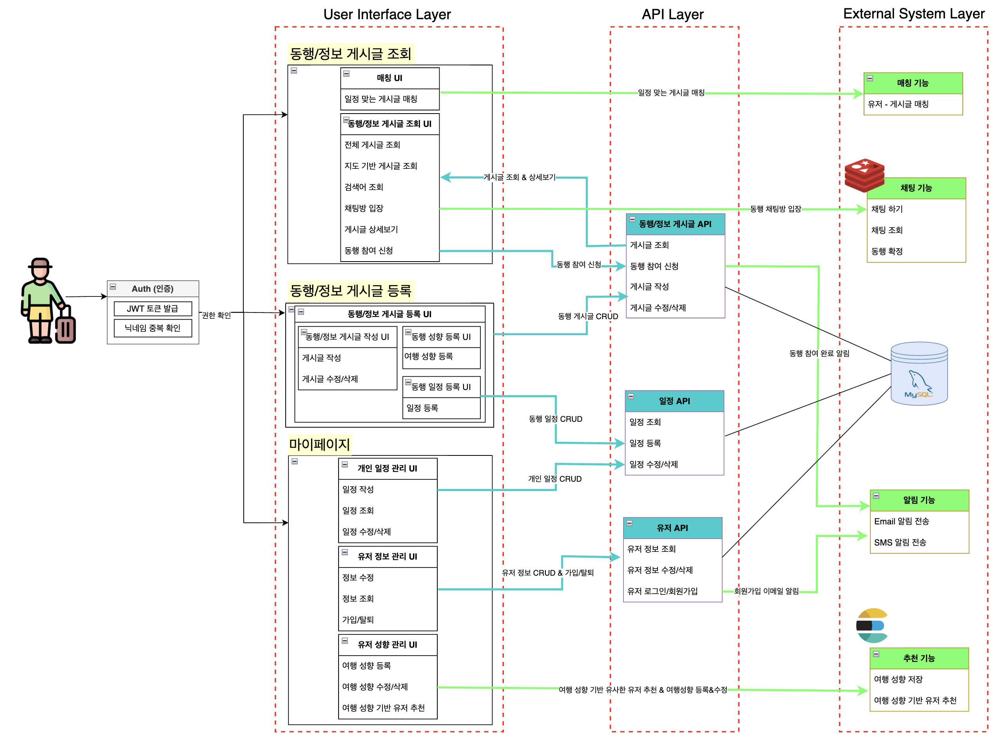
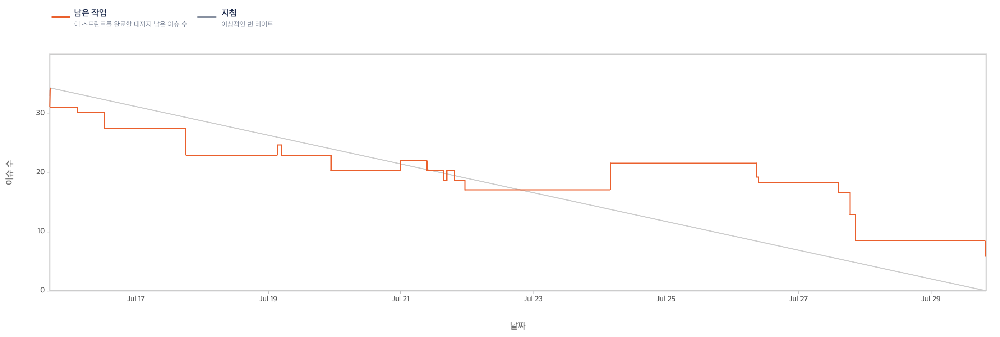
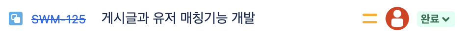
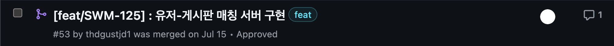

  
  <h1>
    TripMingle 여행 동행 서비스
  </h1>

## 목차

- [1. 프로젝트 개요](#1-프로젝트-개요)
  - [1-1. 프로젝트 소개](#1-1-프로젝트-소개)
  - [1-2. 시스템 구성도](#1-2-시스템-구성도)
  - [1-3. 주요 기능](#1-3-주요-기능)
  - [1-4. 개발 환경](#1-4-개발-환경)
- [2. 프로젝트 설계](#2-프로젝트-설계)
  - [2-1. 헥사고날 아키텍처](#2-1-헥사고날-아키텍처)
  - [2-2. ERD 다이어그램](#2-2-ERD-다이어그램)
  - [2-3. UseCase 다이어그램](#2-3-UseCase-다이어그램)
- [3. 개발 과정](#3-개발-과정)
- [4. 프로젝트 관리](#4-프로젝트-관리)
  - [4-1. Jira ticket을 활용한 task 관리](#4-1-Jira)
  - [4-2. API 서버 개발 및 API 문서화/테스트](#4-2-Swagger-Postman)

## 1. 프로젝트 개요

### 1-1. 프로젝트 소개

TripMingle은 글로벌 여행 동행 서비스로, 여행 동행 찾기, 여행 일정 관리, 여행 동행 매칭 및 추천 서비스, 여행 동행 채팅 서비스를 제공합니다.

### 1-2. 시스템 구성도

### 1-3. 주요 기능

### 1-4. 개발 환경

- Front-end: `TypeScript`, `React.js`, `NextJs14`, `zustand`, `vanilla-extract`, `pnpm`
- Back-end:           

## 2. 프로젝트 설계

### 2-1. 헥사고날 아키텍처

  

    
  

  

    
  
 

### 2-2. ERD 다이어그램

  

### 2-3. UseCase 다이어그램
#### 동행게시판

  

#### 정보게시판 & 마이페이지
 |
--|--|

## 3. 개발 과정

## 4. 프로젝트 관리

### 4-1. Jira ticket을 활용한 task 관리

효율적인 협업과 팀원간의 빠른 피드백을 통해 변화에 신속하게 대응하기 위해 개발 프로세스에는 스크럼 방식을 채택하였습니다.

 
 번다운 차트 등의 지표를 확인할 수 있고, task의 세부 조정이 가능한 Jira를 통해 task를 관리하였습니다.

 Jira의 티켓 번호와 GitHub의 커밋 및 PR을 연동시켜, 작업 내역을 추적하고 효율적인 협업을 도모하였습니다.
### 4-2. API 서버 개발 및 API 문서화/테스트
백엔드 API 서버 개발은 Java와 Spring Boot 기반으로 진행하였으며, OpenAPI Spec에 맞는 RESTful한 API를 개발하였습니다.
 
API 서버 개발은 Swagger와 Postman을 통해 문서화 및 테스트를 진행하였습니다.
#### Swagger

OpenAPI 2.5 Spec을 준수하는 Swagger를 사용하여 API 문서화를 했습니다.
#### Postman

API Platform인 Postman을 이용하여, 개발 환경과 배포 환경 모두 API 테스팅을 할 수 있도록 구성하였습니다.

