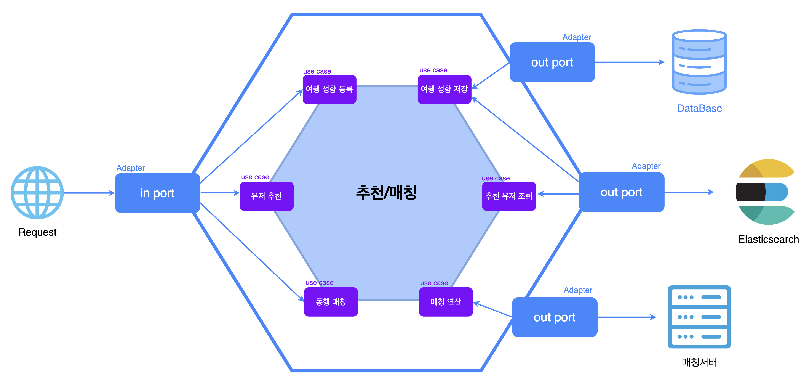

# TripMingle 여행 동행 서비스

글로벌 여행 동행 서비스 입니다.

## 목차

- [1. 프로젝트 개요](#1-프로젝트-개요)
  - [1-1. 프로젝트 소개](#1-1-프로젝트-소개)
  - [1-2. 시스템 구성도](#1-2-시스템-구성도)
  - [1-3. 주요 기능](#1-3-주요-기능)
  - [1-4. 개발 환경](#1-4-개발-환경)
- [2. 프로젝트 설계](#2-프로젝트-설계)
  - [2-1. 헥사고날 아키텍처](#2-1-헥사고날-아키텍처)
- [3. 개발 과정](#3-개발-과정)
- [4. 프로젝트 관리](#4-프로젝트-관리)

## 1. 프로젝트 개요

### 1-1. 프로젝트 소개

### 1-2. 시스템 구성도

### 1-3. 주요 기능

### 1-4. 개발 환경

- Front-end: `JavaScript`, `TypeScript`, `React.js`
- Back-end:           

## 2. 프로젝트 설계

### 2-1. 헥사고날 아키텍처

## 3. 개발 과정

## 4. 프로젝트 관리
