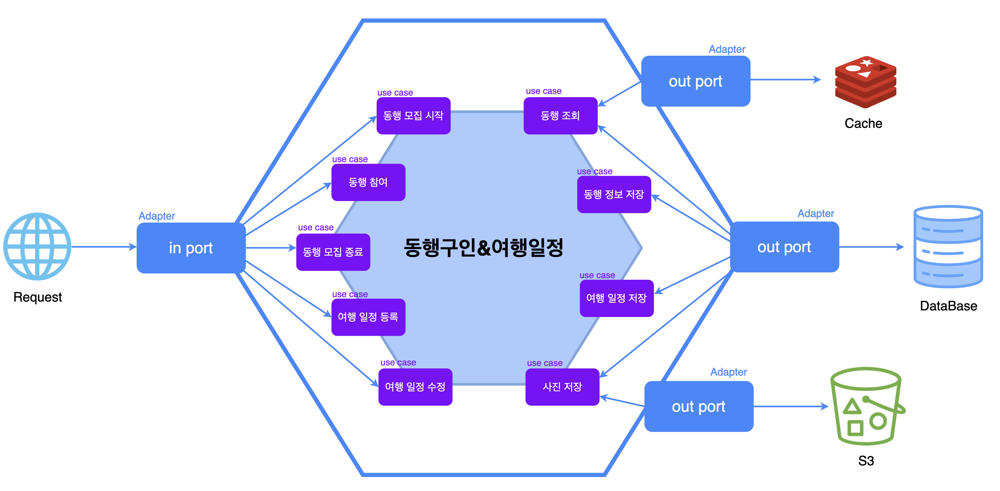

## 목차

- [1. 프로젝트 개요](#1-프로젝트-개요)
  - [1-1. 프로젝트 소개](#1-1-프로젝트-소개)
  - [1-2. 시스템 구성도](#1-2-시스템-구성도)
  - [1-3. 주요 기능](#1-3-주요-기능)
  - [1-4. 개발 환경](#1-4-개발-환경)
- [2. 프로젝트 설계](#2-프로젝트-설계)
  - [2-1. 헥사고날 아키텍처](#2-1-헥사고날-아키텍처)
- [3. 개발 과정](#3-개발-과정)
- [4. 프로젝트 관리](#4-프로젝트-관리)

## 1. 프로젝트 개요

### 1-1. 프로젝트 소개

  
  <h1>
    TripMingle 여행 동행 서비스
  </h1>
  

    Tripmingle은 글로벌 여행 동행 서비스로,
 
  여행 동행 찾기, 여행 일정 관리, 여행 동행 매칭 및 추천 기능을 제공합니다.
  

### 1-2. 시스템 구성도

### 1-3. 주요 기능

### 1-4. 개발 환경

- Front-end: `TypeScript`, `React.js`, `NextJs14`, `zustand`, `vanilla-extract`, `pnpm`
- Back-end:           

## 2. 프로젝트 설계

### 2-1. 헥사고날 아키텍처

## 3. 개발 과정

## 4. 프로젝트 관리

### 4-1. Jira ticket을 활용한 task 관리

효율적인 협업과 팀원간의 빠른 피드백을 통해 변화에 신속하게 대응하기 위해 개발 프로세스에는 스크럼 방식을 채택하였습니다.

 
 번다운 차트 등의 지표를 확인할 수 있고, task의 세부 조정이 가능한 Jira를 통해 task를 관리하였습니다.

 Jira의 티켓 번호와 GitHub의 커밋 및 PR을 연동시켜, 작업 내역을 추적하고 효율적인 협업을 도모하였습니다.

